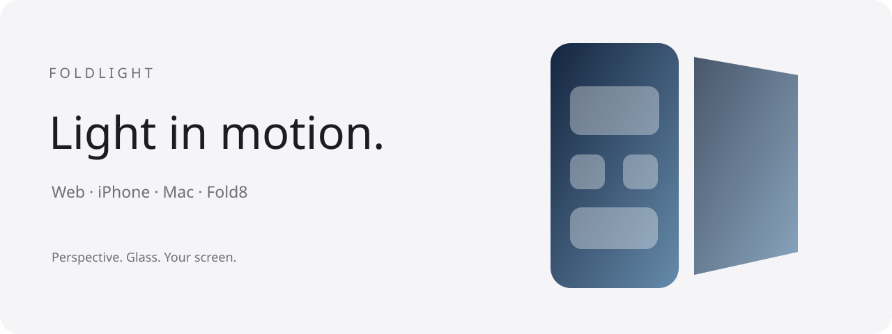

# Foldlight · 折光

[](https://github.com/win223909/foldlight/actions/workflows/ci.yml)
[](LICENSE)

**Perspective, frosted glass and light that follow how you move a screen.**

[中文说明](README.zh-CN.md) · [Live demo & downloads](https://duo.zksaga.com/) · [Build guide](docs/BUILDING.md) · [Architecture](docs/ARCHITECTURE.md)



Foldlight is a collection of native and web experiments inspired by [DuoLikeAnimation](https://github.com/elijah-semyonov/DuoLikeAnimation) by Elijah Semyonov. It uses cached Gaussian glass textures, perspective projection and continuous motion interpolation.

| Platform | What it does | Requirements / current version |
| --- | --- | --- |
| Web | Drag or tilt an image, upload your own, switch Chinese/English, enter immersive view | Modern WebGL 2 browser; HTTPS for phone motion |
| iPhone | Native photo demo driven by device orientation | iOS 26.5+; 1.0.3 |
| macOS | Menu bar app rendering a live desktop effect as the lid moves | macOS 13+; Apple Silicon / Intel; 0.2.4 |
| Fold8 | Independent cover and inner images, continuous hinge tracking, per-direction controls | Android 11+ build minimum; tested on SM-F9710 / Android 17 / One UI 9; 0.3.7 |

The web, iPhone and Android apps render their own images. They do **not** replace system-wide home-screen or app transitions. The Mac app needs Screen Recording permission for live desktop rendering. Fold8 continuous angle access and concurrent displays require user-authorized Shizuku and compatible Samsung firmware; support is not universal.

## Quick start

```sh
git clone https://github.com/win223909/foldlight.git
cd foldlight
npm run dev
# Open http://127.0.0.1:4178
```

The web project has no npm runtime dependencies. Node.js 20+ is sufficient.

```sh
npm test
npm run build         # build/WebRelease/duo-static
npm run check:public  # scan the files selected for Git
```

Native builds, optional analytics setup and real-device checks are documented in [BUILDING.md](docs/BUILDING.md). Download links in the source website point to hosted, versioned packages; large installers are kept out of Git.

## Fold8 controls

Settings are grouped by **Cover → Opening / Closing**, **Inner left → Opening / Closing**, then shared controls. Each direction has its own deformation start, speed, amplitude, acceleration curve and brightness start. Each screen has separate 0–100% frost and gradient intensity. The inner right half stays clear and stationary. Hold two fingers for about 0.65 seconds to open settings.

## Repository

- `web/`: dependency-free, bilingual browser demo.
- `DuoLikeAnimation/` and `.xcodeproj`: native iPhone app; the upstream target name is retained.
- `macos/`: AppKit / SwiftUI, ScreenCaptureKit and Metal desktop app.
- `android/`: Java / OpenGL ES app, hinge input and Shizuku service.
- `analytics/`: optional authenticated, log-based visitor statistics; not required by the demo.
- `docs/`: architecture, build, compatibility and release guidance.
- `.github/`: CI, issue forms, pull-request template and an opt-in dependency-update template.

## Compatibility and verification

CI checks web tests and static builds, Android unit tests/lint/build, analytics tests, a Mac universal build and an iOS Simulator build. GPU and sensor checks require suitable physical hardware; passing CI does not prove real folding smoothness. See [COMPATIBILITY.md](docs/COMPATIBILITY.md).

The repository uses an original vector demo screen. Personal wallpapers, third-party device screenshots, signing credentials, deployment secrets, visitor records and device logs are excluded. Existing production releases may use different demo artwork.

## Contributing

See [CONTRIBUTING.md](CONTRIBUTING.md), [SECURITY.md](SECURITY.md) and [CHANGELOG.md](CHANGELOG.md). Report the platform, version and exact reproduction steps; avoid attaching personal screenshots or raw device identifiers.

## License and credits

MIT. Copyright notices for Elijah Semyonov and ZK are retained in [LICENSE](LICENSE). See [THIRD_PARTY_NOTICES.md](THIRD_PARTY_NOTICES.md) for dependencies and artwork. This project is not affiliated with Apple, Samsung or Shizuku.

Made by **ZK**.
