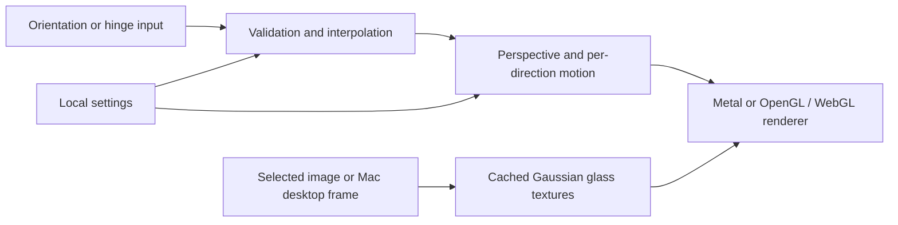

# Architecture

Each native platform owns its rendering and input loop; this repository is a monorepo, not a shared cross-platform runtime.

## Web and iPhone

The browser uses orientation events or dragging, an original example image and WebGL 2. iPhone uses Core Motion, SwiftUI and Metal. Photo handling stays local; iPhone persists an app-private downscaled copy, while the website restores its default image on reload. Browser permissions and fullscreen support vary.

## Mac

ScreenCaptureKit supplies desktop frames to Metal. Lid HID reports are validated and interpolated before projection. A menu bar app controls capture and an overlay. Screen Recording authorization is mandatory for this real-time capture path. Closing the lid still follows system sleep policy.

## Fold8

Samsung continuous angle logs are read by an authorized Shizuku service, then delivered through Binder to the app. Standard sensor/state paths remain fallbacks. The service manages a temporary concurrent-display session, not a system wallpaper replacement. Gesture-specific deformation and brightness controllers feed OpenGL ES renderers for the cover and inner screen. Only the inner left pane moves; settings are a separate native layer.

## Optional analytics

The website needs no analytics module to run. `analytics/` reads a dedicated nginx log and stores bounded detail in SQLite. It exposes an authenticated admin interface on loopback and checks Cloudflare Access JWTs itself. Do not mix real visitor records into source or test fixtures.
